# 🚀 Doodle to CAD

**Sketch → Get a Design → 3D Print.** A local-first web app that turns an
imperfect hand doodle — plus optional text notes and a target size — into
parametric OpenSCAD, a compiled STL, and an interactive 3D preview. Nothing
leaves your machine: the multimodal model runs locally (vLLM), the CAD kernel
is OpenSCAD, the viewer is your browser.

| Your sketch (as drawn) | Generated part, front view | Generated part, right view | Generated part, 3D view |
|---|---|---|---|
| 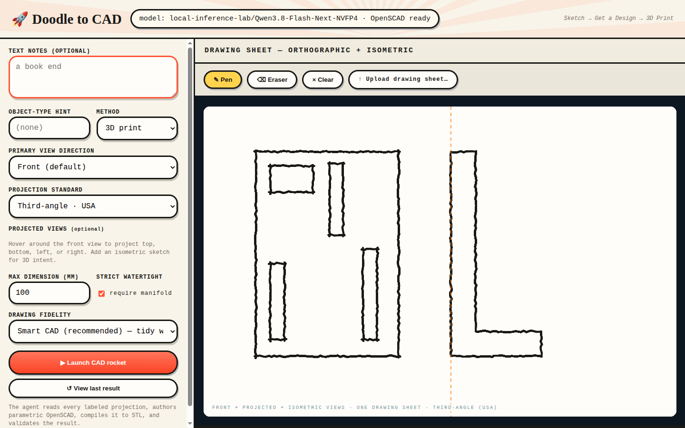 | 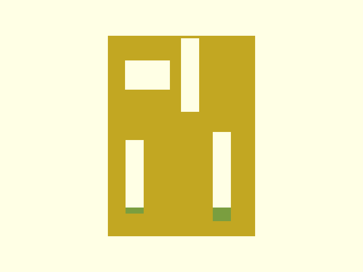 | 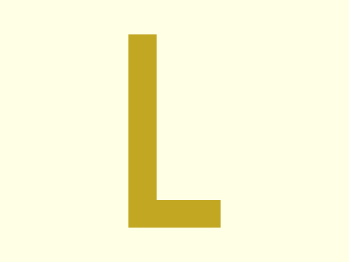 | 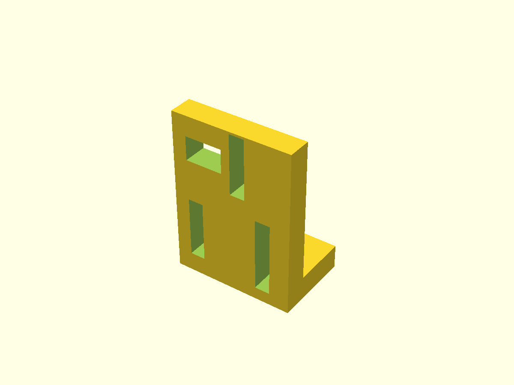 |

*One hand-drawn two-view sheet → 100/100 supervisor score → verified four
through-holes. The part was written as [parametric OpenSCAD](docs/demo/multiview_model.scad);
details and full pipeline below.*

## See it work

### From pen ink to a verified part, in one take

The pen draws a genuine two-view engineering sheet — a front plate with four
rectangular through-cutout loops, plus a thin-L side profile. No dimension
text, no hole descriptions: the interpretation comes from ink alone.

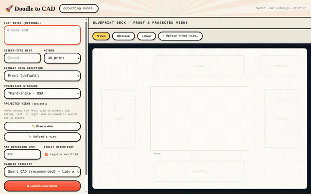

The pipeline authors parametric OpenSCAD, compiles it, and a CAD supervisor
scores the result. This run was **accepted 100/100 on the first attempt in
91 s** by a local Qwen model. Orbit the accepted bracket — the four cutouts go
clean through the vertical back plate:

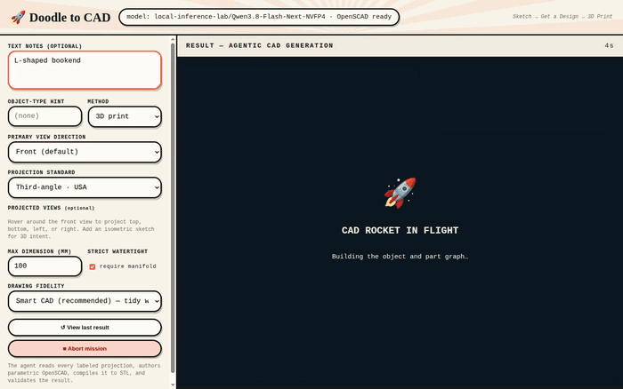

The same part, rendered from a fixed 3/4 angle — the L profile, plate
thickness, and all four rectangular through-holes in one frame:


This result isn't just eyeballed: an independent STL topology check
(`scripts/verify_stl.py`) confirms **genus 4 — exactly four through-holes**,
one watertight component, and dimensions within 9% of the reference
proportions. The supervisor's own front-view render agrees:

| Your sketch (as drawn) | Generated part, front view | Generated part, right view | Generated part, 3D view |
|---|---|---|---|
|  |  |  |  |

The model wrote this part as parametric OpenSCAD —
[`multiview_model.scad`](docs/demo/multiview_model.scad), shown in full below:

<details>
<summary>The parametric OpenSCAD the model wrote for this part (101 lines)</summary>

```openscad
// L-shaped bookend
// Derived sizes: width=73.11 (X), depth=47.78 (Y), height=100.0 (Z)
// Right view (view_1) defines the L-profile in YZ plane, extruded along X.
// Front view (view_2) defines four rectangular through-cutouts on the vertical face, cut along Y.

// --- Parameters ---
width = 73.11;      // X
depth = 47.78;      // Y
height = 100.0;     // Z

// L-profile parameters derived from right view polygon
// Right view: u maps to +Y, v maps to -Z
// Polygon points (u,v) -> (Y, Z):
// (0.0462, 0.0157) -> Y=2.21, Z=98.43
// (0.0462, 0.9822) -> Y=2.21, Z=1.78
// (0.9394, 0.9866) -> Y=44.88, Z=1.34
// (0.9441, 0.8594) -> Y=45.11, Z=14.06
// (0.3024, 0.855)  -> Y=14.45, Z=14.50
// (0.3116, 0.0157) -> Y=14.89, Z=98.43

// Simplified L-profile:
// Vertical backplate: Y from 0 to backplate_depth, Z from 0 to height
// Horizontal base: Y from 0 to depth, Z from 0 to base_height
// The inner corner is at (Y=inner_y, Z=inner_z)

backplate_depth = 14.5;  // Y extent of vertical part
base_height = 14.5;      // Z extent of horizontal part

// Cutout parameters from front view (view_2)
// Front view: u maps to +X, v maps to -Z
// Outer profile spans u: 0.0302-0.9665, v: 0.0133-0.9823
// Map to physical: X = u * width, Z = (1-v) * height

// Cutout 1 (contour_8): upper-left window
// center_view_normalized: (0.2689, 0.1968), size: (0.3069, 0.146)
c1_cx = 0.2689 * width;
c1_cz = (1.0 - 0.1968) * height;
c1_w = 0.3069 * width;
c1_h = 0.146 * height;

// Cutout 2 (contour_10): upper-right vertical slot
// center_view_normalized: (0.5577, 0.1968), size: (0.1245, 0.3661)
c2_cx = 0.5577 * width;
c2_cz = (1.0 - 0.1968) * height;
c2_w = 0.1245 * width;
c2_h = 0.3661 * height;

// Cutout 3 (contour_6): lower-right vertical slot
// center_view_normalized: (0.7734, 0.7024), size: (0.1245, 0.4447)
c3_cx = 0.7734 * width;
c3_cz = (1.0 - 0.7024) * height;
c3_w = 0.1245 * width;
c3_h = 0.4447 * height;

// Cutout 4 (contour_4): lower-left vertical slot
// center_view_normalized: (0.1822, 0.7024), size: (0.1245, 0.3661)
c4_cx = 0.1822 * width;
c4_cz = (1.0 - 0.7024) * height;
c4_w = 0.1245 * width;
c4_h = 0.3661 * height;

eps = 0.01;

// --- Modules ---

module l_profile() {
    // L-shape in YZ plane, extruded along X
    // Vertical backplate: Y [0, backplate_depth], Z [0, height]
    // Horizontal base: Y [0, depth], Z [0, base_height]
    // Union of two boxes
    translate([0, 0, 0])
        cube([width, backplate_depth, height]);
    translate([0, 0, 0])
        cube([width, depth, base_height]);
}

module cutout_cutter(cx, cz, w, h) {
    // Rectangular through-cutout on vertical face (front face at Y=0)
    // Cut along Y axis. The cutter spans Y from -eps to backplate_depth+eps
    // Centered at (cx, cz) in XZ plane
    translate([cx - w/2, -eps, cz - h/2])
        cube([w, backplate_depth + 2*eps, h]);
}

// --- Main Design ---

difference() {
    l_profile();
    
    // Cutout 1: upper-left window
    cutout_cutter(c1_cx, c1_cz, c1_w, c1_h);
    
    // Cutout 2: upper-right vertical slot
    cutout_cutter(c2_cx, c2_cz, c2_w, c2_h);
    
    // Cutout 3: lower-right vertical slot
    cutout_cutter(c3_cx, c3_cz, c3_w, c3_h);
    
    // Cutout 4: lower-left vertical slot
    cutout_cutter(c4_cx, c4_cz, c4_w, c4_h);
}
```

The exact, complete source — including all four cutout contours and the
L-profile polygon with per-vertex view-mapping comments — is in
[`docs/demo/multiview_model.scad`](docs/demo/multiview_model.scad).

</details>

### Reshape the model without redrawing it

A simpler single-view doodle: an L-bookend with a thumb hole. After
generation, **Modify** opens parametric sliders extracted from the SCAD
source — drag one and the mesh recompiles live, camera untouched.

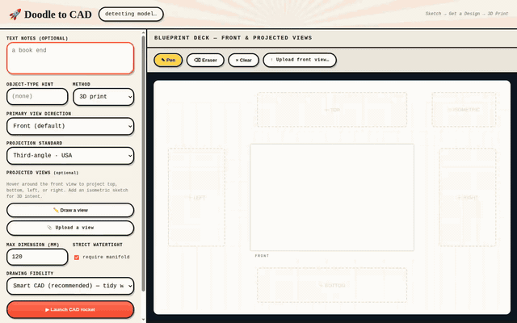

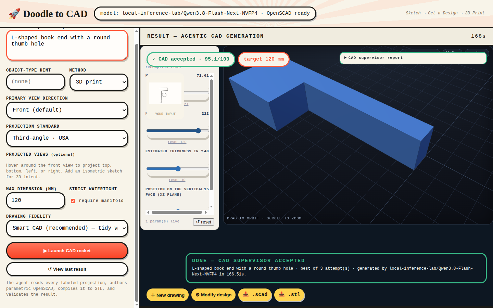

### Every stage, up close

| Stage | What happens |
|---|---|
|  | **One continuous drawing sheet.** Front view plus projected top/bottom/left/right/isometric regions, orthographic guide lines snapped to your own ink. |
| 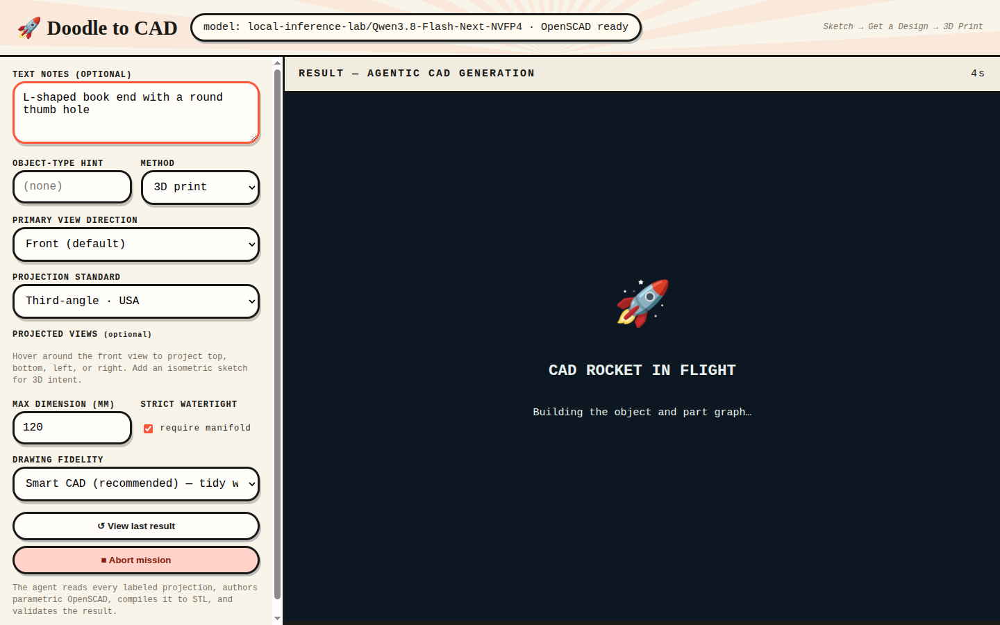 | **Agentic generation.** OpenCV ink analysis → model interpretation → SCAD authoring → compile, with live stage feedback and an abort button. |
| 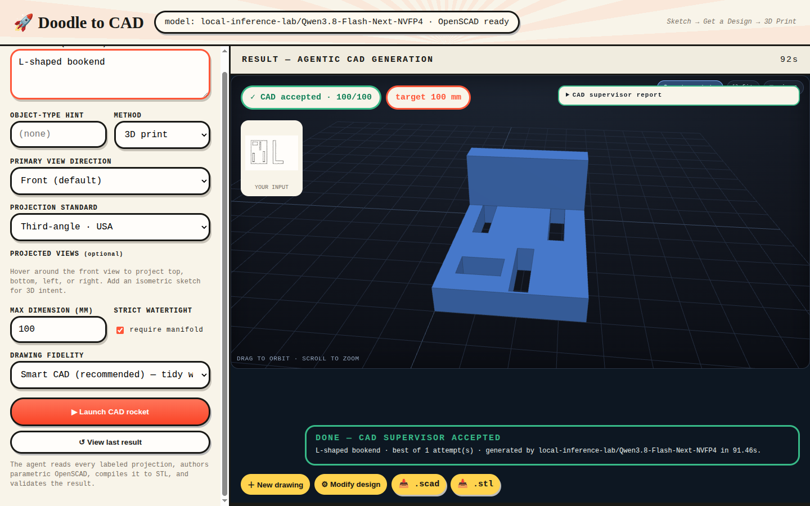 | **Supervised acceptance.** Every candidate is scored on topology, dimensions, required features, and projection similarity; the full attempt history is saved and shown. |
| 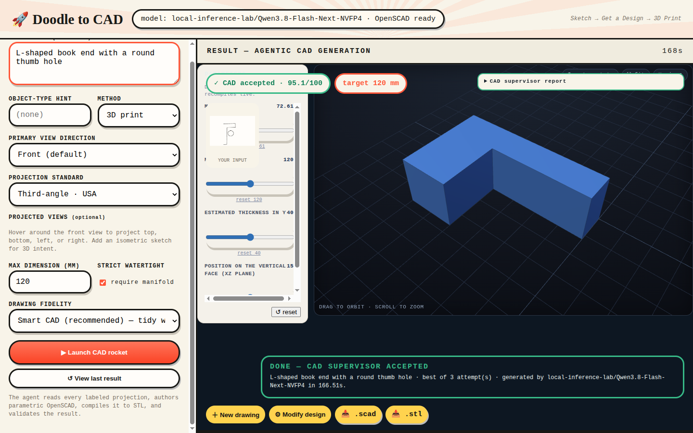 | **Parametric editing.** Editable dimensions become sliders; every change recompiles the model in seconds. |

## How the pipeline works

1. The browser captures the drawing sheet (PNG) plus optional intent text and a maximum dimension.
2. OpenCV extracts ink density, contours, normalized regions, circularity, and lines into a diagnostic overlay.
3. The configured multimodal model converts the images and measurements into a structured part/constraint specification.
4. The same model generates parametric OpenSCAD from that specification.
5. OpenSCAD compiles the STL; the result page loads it into an interactive, auto-rotating 3D viewer.
6. A bounded CAD supervisor scores topology, dimensions, required subtractive features, and projection similarity against every drawn view.
7. It may accept, repair the OpenSCAD, or reinterpret the drawings — keeping the best candidate across attempts, with the full decision history under `results/<run-id>/attempts.json`.

The supervisor is deliberately a small inspectable state machine rather than
a general-purpose agent framework. Known limitation today: its repair
instructions can be too vague to fix a 90° intent flip (e.g. cutting holes in
the foot instead of the wall) — see [`docs/demo/`](docs/demo/README.md) for a
recorded accepted run and a recorded rejected one, side by side.

## What you need before running

Three things must be in place; the app will start without them but generations will fail:

| Requirement | Why | Check |
|---|---|---|
| An OpenAI-compatible model server | Steps 3–4 (interpretation + SCAD generation). Default expects one at `http://127.0.0.1:8000/v1` (e.g. `vllm serve ...`). | `curl http://127.0.0.1:8000/v1/models` |
| OpenSCAD | Step 5 (STL compile + view renders). Native binary or Docker — see below. | `openscad --version` or `docker images openscad/openscad` |
| Python 3.11+ and [uv](https://docs.astral.sh/uv/) | The app itself. | `uv --version` |

Quick health check once running: open <http://127.0.0.1:8080/api/health>. It reports the selected model and whether OpenSCAD is found. `status: "ok"` means you are ready to draw.

## OpenSCAD without a system install

The pipeline has a built-in Docker fallback. If no `openscad` binary is on
`PATH` and `DOODLE_OPENSCAD_DOCKER` is set (see `.env`), every compile/render
runs `docker run --rm -v <work-dir>:/work -w /work <image> bash -c 'Xvfb ...
openscad ...'` — one bind-mount, relative paths, virtual display for the PNG
view renders:

```dotenv
OPENSCAD_BIN=openscad
DOODLE_OPENSCAD_DOCKER=openscad/openscad:latest   # docker pull this one first
```

`scripts/openscad-docker` is a manual-testing alternative to that fallback
(drop-in CLI wrapper for running `.scad` files by hand). With a native
install, unset `DOODLE_OPENSCAD_DOCKER` and point `OPENSCAD_BIN` at the binary.

## Configure

Copy `.env.example` to `.env` if you don't have one, then edit:

```dotenv
OPENAI_BASE_URL=http://127.0.0.1:8000/v1
OPENAI_API_KEY=not-needed
OPENAI_MODEL=
OPENAI_ENABLE_THINKING=false
CAD_AGENT_MAX_ATTEMPTS=3
CAD_AGENT_ACCEPT_SCORE=70
OPENSCAD_BIN=openscad
DOODLE_HOST=127.0.0.1
DOODLE_PORT=8080
```

When `OPENAI_MODEL` is blank, startup calls `GET <OPENAI_BASE_URL>/models`. It prefers model IDs containing common multimodal markers (`vl`, `vision`, `omni`, `gemma-3`, `pixtral`, or `llava`) and otherwise uses the first model returned. Set `OPENAI_MODEL` to override selection. The chosen ID and its selection source appear in `/api/health` and every generation result.

The endpoint must support OpenAI-compatible `GET /models` and `POST /chat/completions`, including image data URLs in message content.

`OPENAI_ENABLE_THINKING=false` is recommended for Qwen reasoning models in this pipeline. It is sent as `chat_template_kwargs.enable_thinking`, preserving the completion-token budget for the required JSON and OpenSCAD answers. There are also per-stage overrides (`OPENAI_STRUCTURED_ENABLE_THINKING`, `OPENAI_CODE_ENABLE_THINKING`) if you want reasoning for interpretation but not for code generation.

## Install and run (uv)

From the repo root — everything is two commands:

```bash
cd <this repo>
uv sync --extra dev
uv run python run.py
```

`uv sync` creates `.venv/` from `uv.lock` and installs the package in editable mode. Then open <http://127.0.0.1:8080> and draw something. Change the port with `DOODLE_PORT` in `.env`.

Prefer plain pip instead of uv?

```bash
python3 -m venv .venv && source .venv/bin/activate
pip install -e '.[dev]'
python run.py
```

If `.venv/` ever misbehaves (e.g. built on another machine — uv venvs are not relocatable), delete it and rerun `uv sync --extra dev`.

## Tests

```bash
uv run pytest -q
```

## Regenerate the demo assets

All screenshots and GIFs in this README were captured from the running app
with scripted pen input — no mockups. Refresh them after any meaningful
change:

```bash
uv run playwright install chromium
DISPLAY=:1 uv run python scripts/capture_demo_multiview.py   # multiview showcase, ~4 min
DISPLAY=:1 uv run python scripts/capture_demo.py             # single-view + parametric flow, ~5 min
```

Details, stage-by-stage stills, and verification output:
[`docs/demo/`](docs/demo/README.md).

## Troubleshooting

- `/api/health` says `"openscad": {"available": false}` — `OPENSCAD_BIN` isn't on `PATH` or isn't executable. For the Docker shim, verify `docker run --rm --entrypoint openscad openscad/openscad:latest --version` works by hand.
- Generations hang then error — the model server at `OPENAI_BASE_URL` isn't answering. Check `curl <base_url>/models`; `OPENAI_TIMEOUT_SECONDS` (default 300) bounds each call.
- Model returns prose instead of JSON/SCAD — try `OPENAI_ENABLE_THINKING=false` for the failing stage (see per-stage flags above).
- `Address already in use` on startup — another instance holds `DOODLE_PORT`; find it with `ss -tlnp | grep :8080` or set a different `DOODLE_PORT`.

## Current recovery boundary

Implemented: local UI/API, image/text/dimension input, OpenCV evidence, model discovery, structured interpretation, SCAD generation, compile repair, STL, three views, artifacts, downloads, and execution provenance.

Still appropriate for a production phase: a labeled CAD benchmark corpus, stronger camera/view registration, feature-level geometric measurements, candidate fan-out, authentication, cancellation, and queued concurrent jobs.
