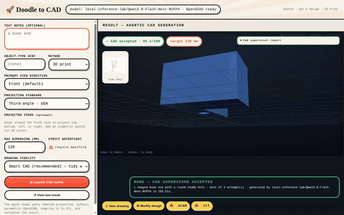

# Doodle to CAD — recovered multi-view pipeline

A local-first web application that converts an imperfect doodle plus optional text and dimensions into parametric OpenSCAD, a compiled STL, and an interactive 3D preview.

## See it work

The full pen-drawn flow — doodle → agentic generation → accepted model → live parametric editing:


Orbit the accepted result (thumb hole sweeps into view) and reshape it with the sliders — the mesh recompiles live, camera untouched:



More stills, videos, and instructions to regenerate everything: [`docs/demo/`](docs/demo/README.md).

## Pipeline

1. The browser uploads a PNG, JPEG, or WebP and optional intent/dimension text.
2. OpenCV extracts ink density, contours, normalized regions, circularity, lines, and a diagnostic overlay.
3. The configured multimodal model converts the original image and measurements into a structured part/constraint specification.
4. The same model generates parametric OpenSCAD from that specification.
5. OpenSCAD compiles STL; the result page loads it into an interactive, auto-rotating 3D viewer.
6. A bounded CAD supervisor scores topology, dimensions, required subtractive features, and projection similarity.
7. It may accept, repair the OpenSCAD, or reinterpret the drawings. It keeps the best candidate across attempts and saves the full decision history under `results/<run-id>/attempts.json`.

This recreates the recovered `codex/multi-view-drawing` product direction. It is a clean-room implementation, not byte-for-byte recovery of the lost repository.

## What you need before running

Three things must be in place; the app will start without them but generations will fail:

| Requirement | Why | Check |
|---|---|---|
| An OpenAI-compatible model server | Steps 3–4 (interpretation + SCAD generation). Default expects one at `http://127.0.0.1:8000/v1` (e.g. `vllm serve ...`). | `curl http://127.0.0.1:8000/v1/models` |
| OpenSCAD | Step 5 (STL compile + view renders). Native binary or Docker — see below. | `openscad --version` or `docker images openscad/openscad` |
| Python 3.11+ and [uv](https://docs.astral.sh/uv/) | The app itself. | `uv --version` |

Quick health check once running: open <http://127.0.0.1:8080/api/health>. It reports the selected model and whether OpenSCAD is found. `status: "ok"` means you are ready to draw.

## OpenSCAD without a system install

The pipeline has a built-in Docker fallback. If no `openscad` binary is on
`PATH` and `DOODLE_OPENSCAD_DOCKER` is set (see `.env`), every compile/render
runs `docker run --rm -v <work-dir>:/work -w /work <image> bash -c 'Xvfb ...
openscad ...'` — one bind-mount, relative paths, virtual display for the PNG
view renders:

```dotenv
OPENSCAD_BIN=openscad
DOODLE_OPENSCAD_DOCKER=openscad/openscad:latest   # docker pull this one first
```

`scripts/openscad-docker` is a manual-testing alternative to that fallback
(drop-in CLI wrapper for running `.scad` files by hand). With a native
install, unset `DOODLE_OPENSCAD_DOCKER` and point `OPENSCAD_BIN` at the binary.

## Configure

Copy `.env.example` to `.env` if you don't have one, then edit:

```dotenv
OPENAI_BASE_URL=http://127.0.0.1:8000/v1
OPENAI_API_KEY=not-needed
OPENAI_MODEL=
OPENAI_ENABLE_THINKING=false
CAD_AGENT_MAX_ATTEMPTS=3
CAD_AGENT_ACCEPT_SCORE=70
OPENSCAD_BIN=openscad
DOODLE_HOST=127.0.0.1
DOODLE_PORT=8080
```

When `OPENAI_MODEL` is blank, startup calls `GET <OPENAI_BASE_URL>/models`. It prefers model IDs containing common multimodal markers (`vl`, `vision`, `omni`, `gemma-3`, `pixtral`, or `llava`) and otherwise uses the first model returned. Set `OPENAI_MODEL` to override selection. The chosen ID and its selection source appear in `/api/health` and every generation result.

The endpoint must support OpenAI-compatible `GET /models` and `POST /chat/completions`, including image data URLs in message content.

`OPENAI_ENABLE_THINKING=false` is recommended for Qwen reasoning models in this pipeline. It is sent as `chat_template_kwargs.enable_thinking`, preserving the completion-token budget for the required JSON and OpenSCAD answers. There are also per-stage overrides (`OPENAI_STRUCTURED_ENABLE_THINKING`, `OPENAI_CODE_ENABLE_THINKING`) if you want reasoning for interpretation but not for code generation.

## Install and run (uv)

From the repo root — everything is two commands:

```bash
cd <this repo>
uv sync --extra dev
uv run python run.py
```

`uv sync` creates `.venv/` from `uv.lock` and installs the package in editable mode. Then open <http://127.0.0.1:8080> and draw something. Change the port with `DOODLE_PORT` in `.env`.

Prefer plain pip instead of uv?

```bash
python3 -m venv .venv && source .venv/bin/activate
pip install -e '.[dev]'
python run.py
```

If `.venv/` ever misbehaves (e.g. built on another machine — uv venvs are not relocatable), delete it and rerun `uv sync --extra dev`.

## Tests

```bash
uv run pytest -q
```

## Troubleshooting

- `/api/health` says `"openscad": {"available": false}` — `OPENSCAD_BIN` isn't on `PATH` or isn't executable. For the Docker shim, verify `docker run --rm --entrypoint openscad openscad/openscad:latest --version` works by hand.
- Generations hang then error — the model server at `OPENAI_BASE_URL` isn't answering. Check `curl <base_url>/models`; `OPENAI_TIMEOUT_SECONDS` (default 300) bounds each call.
- Model returns prose instead of JSON/SCAD — try `OPENAI_ENABLE_THINKING=false` for the failing stage (see per-stage flags above).
- `Address already in use` on startup — another instance holds `DOODLE_PORT`; find it with `ss -tlnp | grep :8080` or set a different `DOODLE_PORT`.

## Current recovery boundary

Implemented: local UI/API, image/text/dimension input, OpenCV evidence, model discovery, structured interpretation, SCAD generation, compile repair, STL, three views, artifacts, downloads, and execution provenance.

Still appropriate for a production phase: a labeled CAD benchmark corpus, stronger camera/view registration, feature-level geometric measurements, candidate fan-out, authentication, cancellation, and queued concurrent jobs. The supervisor is deliberately a small inspectable state machine rather than a general-purpose agent framework.
