# 🚀 Doodle to CAD

**Sketch → Get a Design → 3D Print.** A local-first web app that turns an
imperfect hand doodle — plus optional text notes and a target size — into
parametric OpenSCAD, a compiled STL, and an interactive 3D preview. Nothing
leaves your machine: the multimodal model runs locally (vLLM), the CAD kernel
is OpenSCAD, the viewer is your browser.

| Your sketch (as drawn) | Generated part, front view | Generated part, right view | Generated part, 3D view |
|---|---|---|---|
| 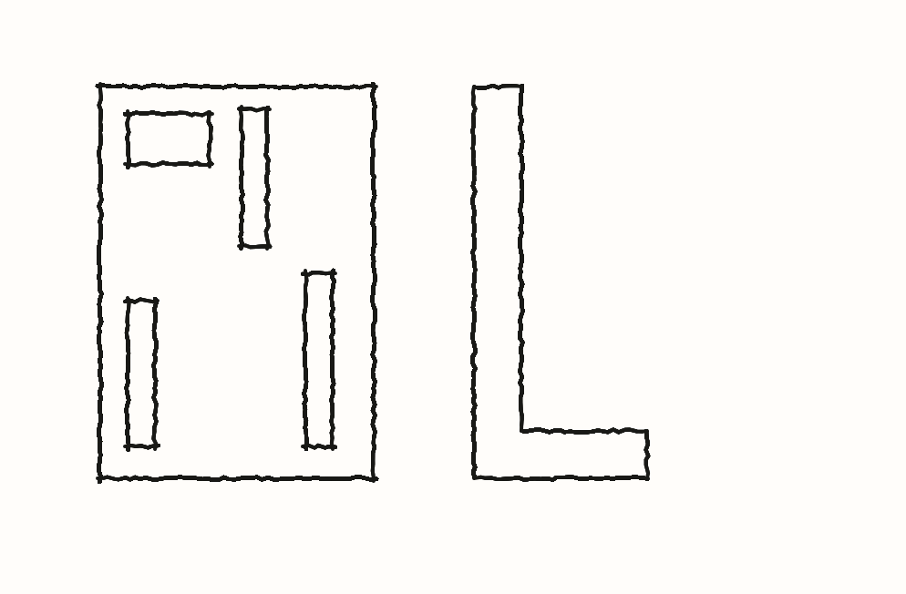 | 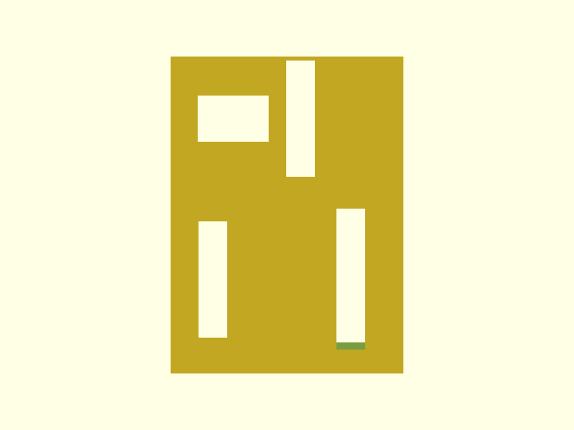 | 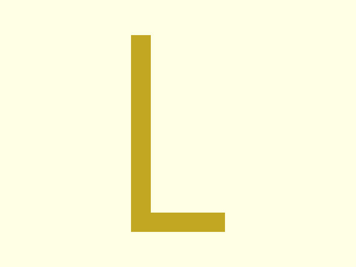 | 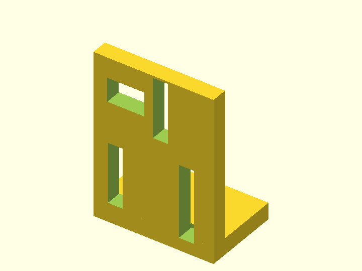 |

*The part is written as .STL and [parametric OpenSCAD](docs/demo/kit_model.scad).*

## See it work

Everything below — GIFs, stills, the hero video in the media kit — is cut
from **one continuous recording of one live session**: one doodle, one
generation, one result. No spliced states, no cherry-picked second run.

### From pen ink to a verified part, in one take

The pen draws a genuine two-view engineering sheet — a front plate with four
rectangular through-cutout loops, plus a thin-L side profile. The only text
is the hint *"L-shaped bookend"* and a 100 mm target: all hole geometry must
come from ink alone.

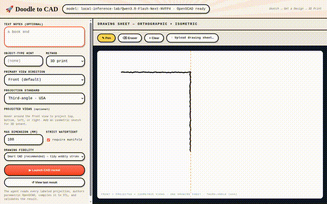

Launch sends it down the pipeline — OpenCV ink analysis → model
interpretation → SCAD authoring → compile — with live stage feedback:

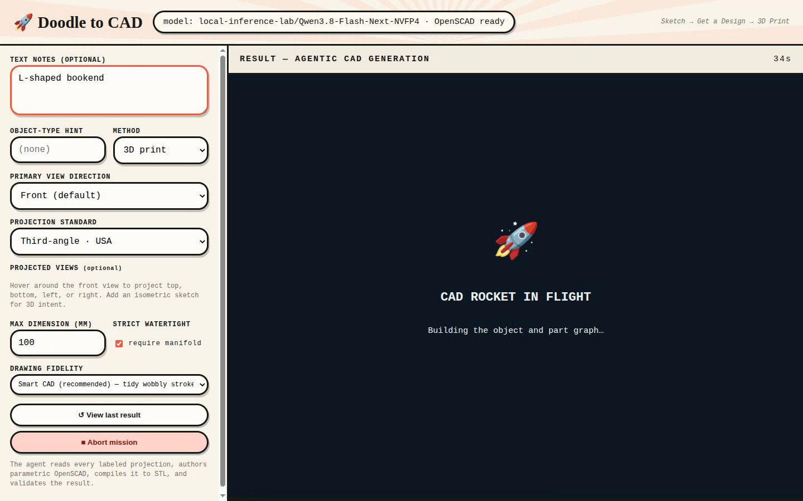

A CAD supervisor scores every candidate on topology, dimensions, required
features, and projection similarity. Here two drafts scored 95.1 and were
**rejected**; the third was **accepted 100/100** — a genuine repair loop,
191 s end to end on a local Qwen model:

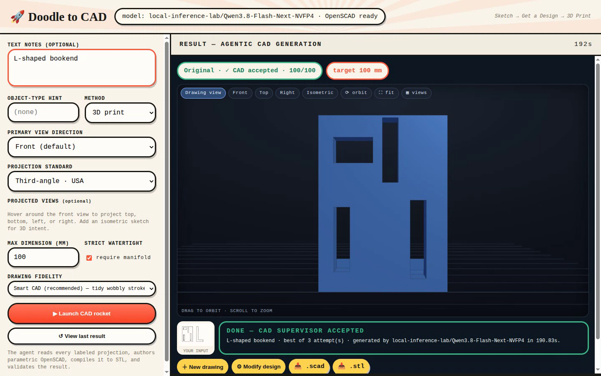

Orbit the accepted bracket — the four cutouts go clean through the vertical
back plate:

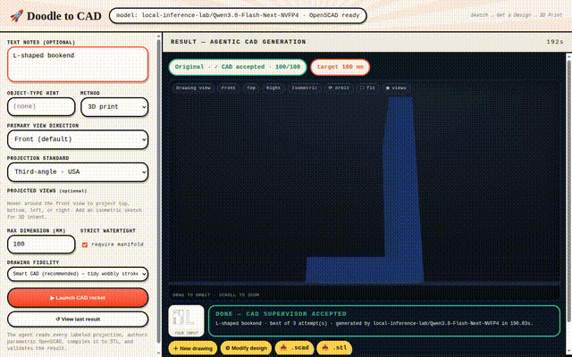

The same part, rendered from a fixed 3/4 camera — the L profile, plate
thickness, and all four rectangular through-holes in one frame:


This result isn't just eyeballed: an independent STL topology check
(`scripts/verify_stl.py`) confirms **genus 4 — exactly four through-holes**,
one watertight component (closed manifold, edge defect 0), and extents
**73.11 × 47.78 × 100.00 mm** — max dimension exactly on the 100 mm target.
The supervisor's own fixed-camera renders agree:

| Your sketch (as drawn) | Generated part, front view | Generated part, right view | Generated part, 3D view |
|---|---|---|---|
|  |  |  |  |

The model wrote this part as parametric OpenSCAD with a `doodle-meta` block
declaring which variables are editable — head of
[`kit_model.scad`](docs/demo/kit_model.scad):

```openscad
/* doodle-meta {"version":1,"parameters":{
     "width":  {"label":"Overall width",  "unit":"mm","feature":"body_width"},
     "depth":  {"label":"Overall depth",  "unit":"mm","feature":"body_depth"},
     "height": {"label":"Overall height", "unit":"mm","feature":"body_height"},
     "thickness":{"label":"Wall thickness","unit":"mm","feature":"wall_thickness"}},
   "features":{"body_width":{"kind":"dimension","axis":"x"}, ...}} */

width  = 73.11;
depth  = 47.78;
height = 100.0;
thickness = 10.0;
```

The exact, complete source — 214 lines, including the model's per-vertex
view-mapping reasoning comments and all four cutout contours — is in
[`docs/demo/kit_model.scad`](docs/demo/kit_model.scad):

<details>
<summary>The parametric OpenSCAD the model wrote for this part (214 lines)</summary>

```openscad
/* doodle-meta {"version":1,"parameters":{"width":{"label":"Overall width","description":"Changes the body width","unit":"mm","feature":"body_width"},"depth":{"label":"Overall depth","description":"Changes the body depth","unit":"mm","feature":"body_depth"},"height":{"label":"Overall height","description":"Changes the body height","unit":"mm","feature":"body_height"},"thickness":{"label":"Wall thickness","description":"Thickness of the L-shape walls","unit":"mm","feature":"wall_thickness"}},"features":{"body_width":{"kind":"dimension","axis":"x","label":"Overall width"},"body_depth":{"kind":"dimension","axis":"y","label":"Overall depth"},"body_height":{"kind":"dimension","axis":"z","label":"Overall height"},"wall_thickness":{"kind":"dimension","axis":"z","label":"Wall thickness"}}} */

// Parameters
width = 73.11;
depth = 47.78;
height = 100.0;
thickness = 10.0; // Estimated from aspect ratio

// Derived dimensions
base_height = thickness;
backplate_width = thickness;
front_face_width = width;
front_face_height = height;

// Cutout parameters (derived from front view proportions)
// View 2 (Front) mapping: X = u * width, Z = (1-v) * height
// Outer profile bbox in view: [0.0242, 0.0111, 0.9483, 0.9778] -> Width ~0.924, Height ~0.967
// Let's normalize cutout positions relative to the outer profile bounds for robustness.
// Outer profile in view coords:
// u_min = 0.0242, u_max = 0.9665 (approx from polygon) -> span_u = 0.9423
// v_min = 0.0111, v_max = 0.9823 (approx from polygon) -> span_v = 0.9712
// Actual CAD width/height correspond to these spans.
// However, the spec says "measured ink spans x authoritative max dimension".
// The outer profile polygon vertices are roughly:
// (0.0302, 0.0133), (0.0302, 0.9823), (0.9634, 0.98), (0.9665, 0.0177)
// This is a rectangle covering almost the whole view.
// Let's assume the outer profile defines the full width and height of the front face.
// So u=0 maps to X=0, u=1 maps to X=width. v=0 maps to Z=height, v=1 maps to Z=0.

// Cutout 1 (contour_8): Top Left Square-ish
// Center: (0.2689, 0.1968)
// Size: (0.3069, 0.146)
// X_center = 0.2689 * width
// Z_center = (1 - 0.1968) * height
// w = 0.3069 * width
// h = 0.146 * height

// Cutout 2 (contour_10): Top Right Slot
// Center: (0.5577, 0.1968)
// Size: (0.1245, 0.3661)
// X_center = 0.5577 * width
// Z_center = (1 - 0.1968) * height
// w = 0.1245 * width
// h = 0.3661 * height

// Cutout 3 (contour_6): Bottom Right Slot
// Center: (0.7734, 0.7024)
// Size: (0.1245, 0.4447)
// X_center = 0.7734 * width
// Z_center = (1 - 0.7024) * height
// w = 0.1245 * width
// h = 0.4447 * height

// Cutout 4 (contour_4): Bottom Left Slot
// Center: (0.1822, 0.7024)
// Size: (0.1245, 0.3661)
// X_center = 0.1822 * width
// Z_center = (1 - 0.7024) * height
// w = 0.1245 * width
// h = 0.3661 * height

// Helper module for rectangular cutout through Y axis
module rect_cutout(x, z, w, h, depth_cut) {
    // Centered at x, z in XZ plane.
    // Cut along Y.
    // The backplate is at Y=0 to Y=thickness.
    // We need to cut through the backplate.
    // The cutout should be centered on the backplate thickness? 
    // Usually decorative cutouts go through the visible face.
    // The front face is at Y=0 (if we orient the L such that the vertical part is at Y=0..thickness).
    // Wait, let's define the L-shape orientation carefully.
    
    // Right View (View 1) shows the L-profile.
    // View 1 is Right View. u -> +Y, v -> -Z.
    // Polygon: (0.0462, 0.0157) -> (0.0462, 0.9822) -> (0.9394, 0.9866) -> (0.9441, 0.8594) -> (0.3024, 0.855) -> (0.3116, 0.0157)
    // This looks like an L-shape.
    // Let's map it to Y-Z.
    // u=0 is Y=0 (Front of part? No, Right view looks down X. u is Y. u=0 is left of view. 
    // Standard Right View: Looking from +X towards -X. 
    // The "left" of the right view corresponds to the FRONT of the object (Y=0) if we assume standard third angle?
    // Actually, in third angle projection, the Right View is placed to the right of the Front View.
    // The Right View shows the object from the right side.
    // The horizontal axis of the Right View is Depth (Y).
    // Usually, the left side of the Right View corresponds to the Front of the object (Y=0) and the right side to the Back (Y=depth).
    // Let's verify with the polygon.
    // The L-shape has a vertical backplate and a horizontal base.
    // The vertical part is usually at the back (Y=depth) or front?
    // A bookend usually has the vertical part at the back to support books, and the base extends forward.
    // So the vertical wall is at Y=depth-thickness to Y=depth? Or Y=0 to Y=thickness?
    // If the vertical wall is at the back, it's at high Y.
    // Let's look at the polygon in View 1 (Right View).
    // Points:
    // (0.0462, 0.0157) -> Top Left
    // (0.0462, 0.9822) -> Bottom Left
    // (0.9394, 0.9866) -> Bottom Right
    // (0.9441, 0.8594) -> Step Up on Right
    // (0.3024, 0.855) -> Step Left
    // (0.3116, 0.0157) -> Top Right (inner corner)
    
    // This shape is an inverted L? Or standard L?
    // Left side (u~0.05) goes from v~0.01 to v~0.98. This is a tall vertical bar on the LEFT of the view.
    // Bottom side (v~0.98) goes from u~0.05 to u~0.94. This is a wide horizontal bar at the BOTTOM.
    // The "cutout" of the L is at the top right.
    // So the material is on the Left and Bottom of the Right View.
    // If Left of Right View = Front (Y=0), then the vertical wall is at the FRONT (Y=0..thickness).
    // And the base extends to the BACK (Y=0..depth).
    // This is a "front-facing" bookend? Or maybe the view is mirrored?
    // Let's re-read standard mapping.
    // Right View: u maps to +Y.
    // If u=0 is Y=0, then the vertical wall is at Y=0.
    // This means the vertical wall is at the FRONT.
    // The base extends from Y=0 to Y=depth.
    // This is a valid L-shape.
    
    // Now, where are the cutouts?
    // The cutouts are on the "Front Face".
    // If the vertical wall is at Y=0..thickness, the "Front Face" visible from the front (looking down Y) is the face at Y=0?
    // Or is the "Front Face" the large vertical surface?
    // The Front View (View 2) shows the cutouts.
    // The Front View looks down Y.
    // If the vertical wall is at Y=0..thickness, looking from -Y (Front) we see the face at Y=0.
    // So the cutouts go through the wall at Y=0..thickness.
    
    // Let's construct the L-shape:
    // Vertical part: X=0..width, Y=0..thickness, Z=0..height.
    // Horizontal part: X=0..width, Y=0..depth, Z=0..thickness.
    // This forms an L with the corner at (0,0,0).
    // The vertical wall is at the front (Y=0).
    // The base extends backward (Y>0).
    
    // Cutouts are in the vertical wall (Y=0..thickness).
    // They are through-holes along Y.
    
    translate([x, -1, z]) 
        cube([w, depth_cut, h], center=true);
}

// Main Body
difference() {
    // Union of L-shape
    union() {
        // Vertical Backplate (actually Front Plate based on Right View analysis)
        // X: 0 to width
        // Y: 0 to thickness
        // Z: 0 to height
        cube([width, thickness, height]);
        
        // Horizontal Base
        // X: 0 to width
        // Y: 0 to depth
        // Z: 0 to thickness
        // Note: The vertical part already covers Y:0..thickness, Z:0..thickness.
        // So we just add the rest of the base.
        // To avoid overlap issues in CSG (though union handles it), we can just union the two boxes.
        cube([width, depth, thickness]);
    }
    
    // Cutouts
    // All cutouts go through the vertical wall (Y=0..thickness).
    // We need to cut along Y.
    // The cutters should span Y from -eps to thickness+eps.
    
    // Cutout 1: Top Left
    // Center X = 0.2689 * width
    // Center Z = (1 - 0.1968) * height
    // Width = 0.3069 * width
    // Height = 0.146 * height
    c1_x = 0.2689 * width;
    c1_z = (1 - 0.1968) * height;
    c1_w = 0.3069 * width;
    c1_h = 0.146 * height;
    
    translate([c1_x, thickness/2, c1_z])
        cube([c1_w, thickness + 2, c1_h], center=true);
        
    // Cutout 2: Top Right Slot
    // Center X = 0.5577 * width
    // Center Z = (1 - 0.1968) * height
    // Width = 0.1245 * width
    // Height = 0.3661 * height
    c2_x = 0.5577 * width;
    c2_z = (1 - 0.1968) * height;
    c2_w = 0.1245 * width;
    c2_h = 0.3661 * height;
    
    translate([c2_x, thickness/2, c2_z])
        cube([c2_w, thickness + 2, c2_h], center=true);
        
    // Cutout 3: Bottom Right Slot
    // Center X = 0.7734 * width
    // Center Z = (1 - 0.7024) * height
    // Width = 0.1245 * width
    // Height = 0.4447 * height
    c3_x = 0.7734 * width;
    c3_z = (1 - 0.7024) * height;
    c3_w = 0.1245 * width;
    c3_h = 0.4447 * height;
    
    translate([c3_x, thickness/2, c3_z])
        cube([c3_w, thickness + 2, c3_h], center=true);
        
    // Cutout 4: Bottom Left Slot
    // Center X = 0.1822 * width
    // Center Z = (1 - 0.7024) * height
    // Width = 0.1245 * width
    // Height = 0.3661 * height
    c4_x = 0.1822 * width;
    c4_z = (1 - 0.7024) * height;
    c4_w = 0.1245 * width;
    c4_h = 0.3661 * height;
    
    translate([c4_x, thickness/2, c4_z])
        cube([c4_w, thickness + 2, c4_h], center=true);
}
```

</details>

### Reshape the model without redrawing it

Same session, same part: on the accepted result, **⚙ Modify design** opens a
right-side drawer of editable parameters — exactly the variables the model
declared in its `doodle-meta` block. Each row pairs a slider (0.1 steps)
with a precise numeric field (±0.01 stepper buttons, typed entry), shows its
unit and allowed range, and carries a per-parameter reset. Drag or type — the
mesh recompiles live, camera untouched, and downloads (`.scad`/`.stl`) always
follow the geometry you are looking at.

Hover a slider and the model itself points at the feature it owns, with an
on-model dimension overlay:

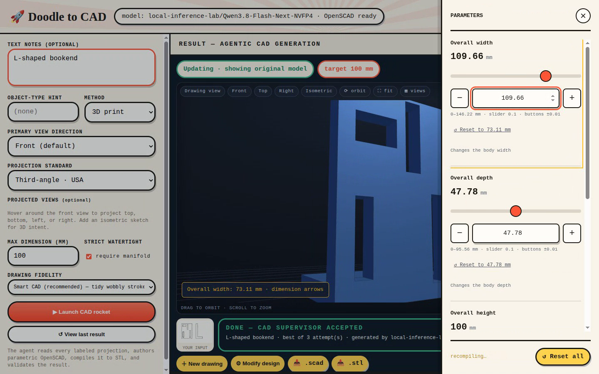

Drag it and the mesh recompiles live, in this same take from 73.11 mm to
109.66 mm — an independent STL check on the edited mesh confirms it is still
genus 4 and manifold at the new extents (109.66 × 47.78 × 100.00 mm):

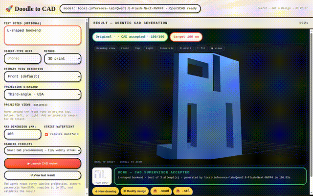

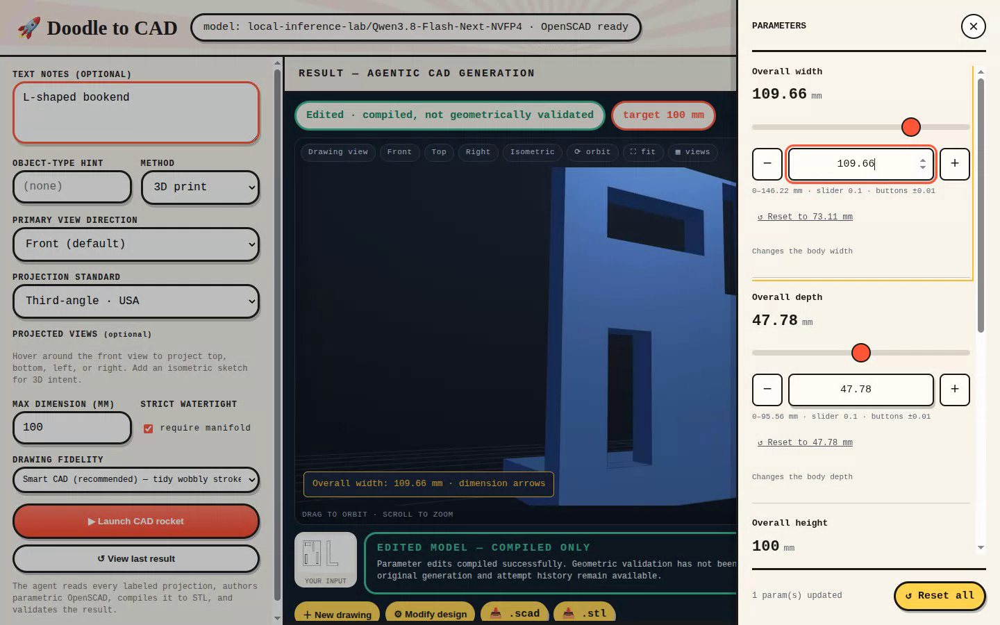

Invalid entries (out of range, non-integer counts) are rejected inline and
block compilation until fixed or reset — the viewer keeps showing the last
successfully compiled geometry, never a broken half-state.


### How to modify a generated part

1. On any result page, press **⚙ Modify design** — the parameter drawer slides
   in from the right.
2. Adjust any parameter three ways: drag its slider, click the −/+ buttons
   (±0.01), or type an exact value in the numeric field. The helper line under
   every row states the allowed range and step sizes.
3. The part recompiles in seconds; the status line confirms
   "*N param(s) updated*". The result badge switches to *Edited — compiled*
   (parameter edits are compiled, not re-scored by the supervisor; original
   generation downloads stay available under "Original generation downloads").
4. **↺ Reset to …** on a row restores that parameter's original value;
   **↺ Reset all** in the drawer footer restores everything.
5. Which parameters appear is authored, not guessed: only top-level numeric
   SCAD variables declared in the model's `doodle-meta` block are exposed
   (with label, description, unit, optional feature link) — internal
   constants stay hidden. See [`docs/parameter-metadata.md`](docs/parameter-metadata.md).

### Every stage, up close

| Stage | What happens |
|---|---|
| 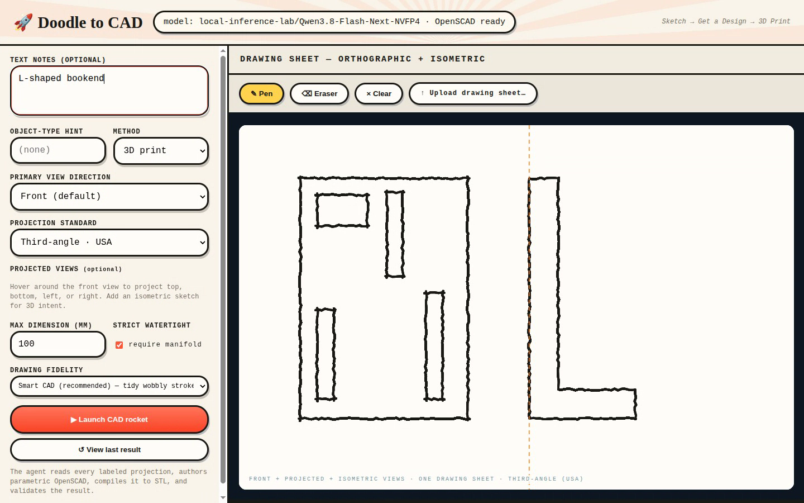 | **One continuous drawing sheet.** Front view plus projected top/bottom/left/right/isometric regions, orthographic guide lines snapped to your own ink. |
|  | **Agentic generation.** OpenCV ink analysis → model interpretation → SCAD authoring → compile, with live stage feedback and an abort button. |
|  | **Supervised acceptance.** Every candidate is scored on topology, dimensions, required features, and projection similarity; the full attempt history is saved and shown. |
|  | **Parametric editing.** Right-side drawer: slider + precise numeric entry per parameter, live recompile, feature highlights in the viewer. |

## How the pipeline works

1. The browser captures the drawing sheet (PNG) plus optional intent text and a maximum dimension.
2. OpenCV extracts ink density, contours, normalized regions, circularity, and lines into a diagnostic overlay.
3. The configured multimodal model converts the images and measurements into a structured part/constraint specification.
4. The same model generates parametric OpenSCAD from that specification.
5. OpenSCAD compiles the STL; the result page loads it into an interactive, auto-rotating 3D viewer.
6. A bounded CAD supervisor scores topology, dimensions, required subtractive features, and projection similarity against every drawn view.
7. It may accept, repair the OpenSCAD, or reinterpret the drawings — keeping the best candidate across attempts, with the full decision history under `results/<run-id>/attempts.json`.

The supervisor is deliberately a small inspectable state machine rather than
a general-purpose agent framework. Known limitation today: its repair
instructions can be too vague to fix a 90° intent flip (e.g. cutting holes in
the foot instead of the wall) — see [`docs/demo/`](docs/demo/README.md) for a
recorded accepted run and a recorded rejected one, side by side.

## What you need before running

Three things must be in place; the app will start without them but generations will fail:

| Requirement | Why | Check |
|---|---|---|
| An OpenAI-compatible model server | Steps 3–4 (interpretation + SCAD generation). Default expects one at `http://127.0.0.1:8000/v1` (e.g. `vllm serve ...`). | `curl http://127.0.0.1:8000/v1/models` |
| OpenSCAD | Step 5 (STL compile + view renders). Native binary or Docker — see below. | `openscad --version` or `docker images openscad/openscad` |
| Python 3.11+ and [uv](https://docs.astral.sh/uv/) | The app itself. | `uv --version` |

Quick health check once running: open <http://127.0.0.1:8080/api/health>. It reports the selected model and whether OpenSCAD is found. `status: "ok"` means you are ready to draw.

## OpenSCAD without a system install

The pipeline has a built-in Docker fallback. If no `openscad` binary is on
`PATH` and `DOODLE_OPENSCAD_DOCKER` is set (see `.env`), every compile/render
runs `docker run --rm -v <work-dir>:/work -w /work <image> bash -c 'Xvfb ...
openscad ...'` — one bind-mount, relative paths, virtual display for the PNG
view renders:

```dotenv
OPENSCAD_BIN=openscad
DOODLE_OPENSCAD_DOCKER=openscad/openscad:latest   # docker pull this one first
```

`scripts/openscad-docker` is a manual-testing alternative to that fallback
(drop-in CLI wrapper for running `.scad` files by hand). With a native
install, unset `DOODLE_OPENSCAD_DOCKER` and point `OPENSCAD_BIN` at the binary.

## Configure

Copy `.env.example` to `.env` if you don't have one, then edit:

```dotenv
OPENAI_BASE_URL=http://127.0.0.1:8000/v1
OPENAI_API_KEY=not-needed
OPENAI_MODEL=
OPENAI_ENABLE_THINKING=false
CAD_AGENT_MAX_ATTEMPTS=3
CAD_AGENT_ACCEPT_SCORE=70
OPENSCAD_BIN=openscad
DOODLE_HOST=127.0.0.1
DOODLE_PORT=8080
```

When `OPENAI_MODEL` is blank, startup calls `GET <OPENAI_BASE_URL>/models`. It prefers model IDs containing common multimodal markers (`vl`, `vision`, `omni`, `gemma-3`, `pixtral`, or `llava`) and otherwise uses the first model returned. Set `OPENAI_MODEL` to override selection. The chosen ID and its selection source appear in `/api/health` and every generation result.

The endpoint must support OpenAI-compatible `GET /models` and `POST /chat/completions`, including image data URLs in message content.

`OPENAI_ENABLE_THINKING=false` is recommended for Qwen reasoning models in this pipeline. It is sent as `chat_template_kwargs.enable_thinking`, preserving the completion-token budget for the required JSON and OpenSCAD answers. There are also per-stage overrides (`OPENAI_STRUCTURED_ENABLE_THINKING`, `OPENAI_CODE_ENABLE_THINKING`) if you want reasoning for interpretation but not for code generation.

## Install and run (uv)

From the repo root — everything is two commands:

```bash
cd <this repo>
uv sync --extra dev
uv run python run.py
```

`uv sync` creates `.venv/` from `uv.lock` and installs the package in editable mode. Then open <http://127.0.0.1:8080> and draw something. Change the port with `DOODLE_PORT` in `.env`.

Prefer plain pip instead of uv?

```bash
python3 -m venv .venv && source .venv/bin/activate
pip install -e '.[dev]'
python run.py
```

If `.venv/` ever misbehaves (e.g. built on another machine — uv venvs are not relocatable), delete it and rerun `uv sync --extra dev`.

## Tests

```bash
uv run pytest -q
```

## Regenerate the demo assets

All screenshots and GIFs in this README were captured from the running app
with scripted pen input — no mockups. The current set (prefix `kit_*`) comes
from the v3 one-take session: a single continuous 251 s recording of one
doodle → generation → acceptance → live edit, cut with
`scripts/cut_demo_kit.py` (beat timeline, speed-ramp, and verification
numbers in the media kit's `PRODUCTION.md`). Refresh them after any
meaningful change:

```bash
DOODLE_PORT=8066 uv run python run.py &                        # app on the capture port
DISPLAY=:1 TAKE_DIR=…/stills VIDEO_DIR=…/raw uv run --no-project --python 3.11 \
  --with "playwright==1.62.0" python scripts/capture_demo_v2.py  # one take, ~5 min
uv run python scripts/cut_demo_kit.py <take>.webm <outdir> --ramp 27:219 \
  --beats blank=4 --beats hero_sheet=24 --beats rocket=60 --beats accepted=228 \
  --beats orbit=240 --beats param_edit=246 --beats width_hint=245.5 \
  --gif drawing=6:16 --gif orbit=231:12 --gif live_edit=243:7
```

Legacy per-flow capture scripts (`capture_demo.py`,
`capture_demo_multiview.py`) still regenerate the older `hero_*`/`20–27_*`
set. Details, stage-by-stage stills, and verification output:
[`docs/demo/`](docs/demo/README.md).

## Troubleshooting

- `/api/health` says `"openscad": {"available": false}` — `OPENSCAD_BIN` isn't on `PATH` or isn't executable. For the Docker shim, verify `docker run --rm --entrypoint openscad openscad/openscad:latest --version` works by hand.
- Generations hang then error — the model server at `OPENAI_BASE_URL` isn't answering. Check `curl <base_url>/models`; `OPENAI_TIMEOUT_SECONDS` (default 300) bounds each call.
- Model returns prose instead of JSON/SCAD — try `OPENAI_ENABLE_THINKING=false` for the failing stage (see per-stage flags above).
- `Address already in use` on startup — another instance holds `DOODLE_PORT`; find it with `ss -tlnp | grep :8080` or set a different `DOODLE_PORT`.

## Current recovery boundary

Implemented: local UI/API, image/text/dimension input, OpenCV evidence, model discovery, structured interpretation, SCAD generation, compile repair, STL, three views, artifacts, downloads, and execution provenance.

Still appropriate for a production phase: a labeled CAD benchmark corpus, stronger camera/view registration, feature-level geometric measurements, candidate fan-out, authentication, cancellation, and queued concurrent jobs.
